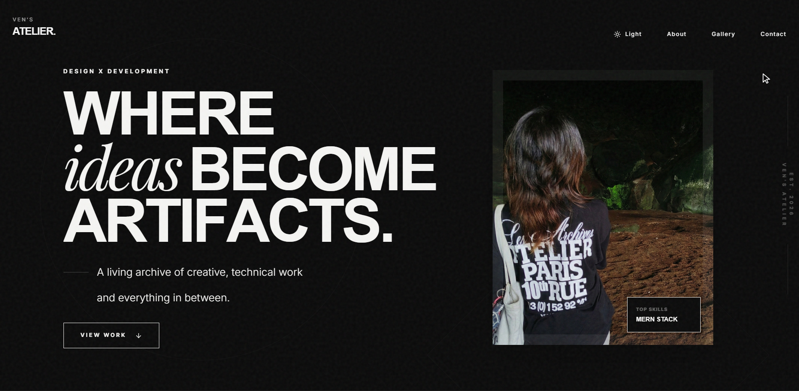

<div align="center">

</div>

<h1 align="center">VEN'S ATELIER</h1>
<p align="center">
  <em>Interactive Portfolio & Creative Showcase</em>
</p>

<p align="center">
  <a href="https://github.com/hiidonuts/vens-atelier" target="_blank">
    
  </a>
  
  
  
  
</p>

---

## About

An interactive portfolio website designed to showcase my creative projects and technical expertise. This website demonstrates smooth animations, custom cursor interactions, and a modern, minimalist aesthetic.


## Features

### **Interactive Design**
- Dynamic cursor that adapts to different interactive elements
- Powered by GSAP and Framer Motion for fluid transitions
- Optimized for all screen sizes and devices
- Seamless theme switching with smooth transitions

### **Technical**
- Built with React 19, TypeScript, and Vite
- Smooth scrolling with Lenis and optimized animations
- Full TypeScript implementation

### **User Experience**
- Organized by categories (AI, Commerce, Creative Dev, etc.)
- In-depth project information with multiple images

## Tech Stack

| Technology | Purpose |
|------------|---------|
| **React 19** | UI Framework |
| **TypeScript** | Type Safety |
| **Vite** | Build Tool & Dev Server |
| **Tailwind CSS** | Styling Framework |
| **GSAP** | Animation Library |
| **Framer Motion** | React Animations |
| **Lenis** | Smooth Scrolling |
| **Lucide React** | Icon Library |
| **Express** | Backend Server |
| **SQLite** | Data Storage |


## Getting Started

### Prerequisites
- Node.js (v18 or higher)
- npm or yarn

### Installation

1. **Clone the repository**
   ```bash
   git clone https://github.com/hiidonuts/vens-atelier.git
   cd vens-atelier
   ```

2. **Install dependencies**
   ```bash
   npm install
   ```

3. **Set up environment variables**
   ```bash
   cp .env.example .env
   # Edit .env with your configuration
   ```

4. **Start the development server**
   ```bash
   npm run dev
   ```

5. **Open your browser**
   Navigate to `http://localhost:5173`

---

<div align="center">
  <p><strong>Crafted with passion and attention to detail</strong></p>
  <p>Built with ❤️ by <a href="https://github.com/hiidonuts">hiidonuts</a></p>
</div>
